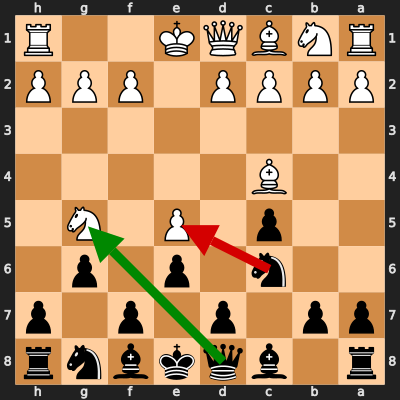
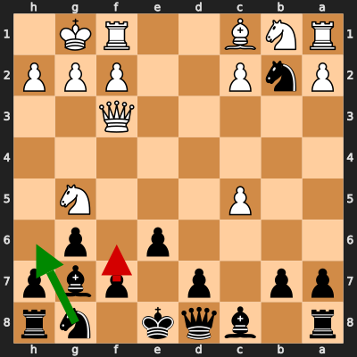
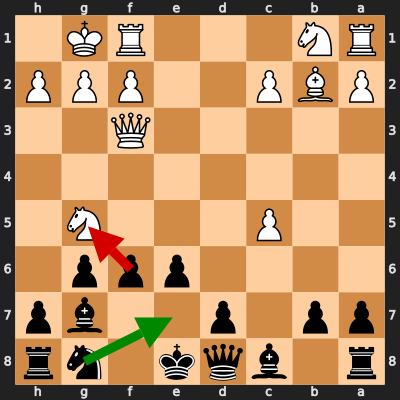

# Analysis: Dodoelsakka vs erivera90

**Date:** 2026.02.03 | **Event:** Live Chess | **Site:** Chess.com

Found **3** crucial moments where evaluation dropped significantly.

## Moment 1

**FEN:** `r1bqkbnr/pp1p1p1p/2n1p1p1/2p1P1N1/2B5/8/PPPP1PPP/RNBQK2R b KQkq - 0 5`

- **You Played:** **Nxe5** ❌ (Red Arrow)
- **Engine Best:** **Qxg5** ✅ (Green Arrow)
- **Eval Swing:** -255 cp
- **Variation:** _Qxg5 O-O Qxe5 Nc3_

### Coach Explanation
Material loss. Nxe5 drops a piece and allows White to build a strong attack. Qxg5 forces a trade, relieving the pressure and retaining material equality.

---
## Moment 2

**FEN:** `r1bqk1nr/pp1p1pbp/4p1p1/2P3N1/8/5Q2/PnP2PPP/RNB2RK1 b kq - 1 9`

- **You Played:** **f6** ❌ (Red Arrow)
- **Engine Best:** **Nh6** ✅ (Green Arrow)
- **Eval Swing:** -327 cp
- **Variation:** _Nh6 Ne4 Nf5 Qb3_

### Coach Explanation
f6 weakens the pawn structure and does nothing to address the threat of the knight on g5, leading to a significant evaluation drop. Nh6 develops a piece, prepares to challenge the knight on g5, and the continuation allows for better development.

---
## Moment 3

**FEN:** `r1bqk1nr/pp1p2bp/4ppp1/2P3N1/8/5Q2/PBP2PPP/RN3RK1 b kq - 0 10`

- **You Played:** **fxg5** ❌ (Red Arrow)
- **Engine Best:** **Ne7** ✅ (Green Arrow)
- **Eval Swing:** -660 cp
- **Variation:** _Ne7 Ne4 O-O Na3_

### Coach Explanation
Pawn structure weakness. fxg5 opens the f-file, exposes the King to attack, and further weakens the pawn structure. Ne7 develops a piece, prepares castling, and improves Black's defensive structure while hindering White's attack.

---

## 3 Key Takeaways

The recurring theme in your errors revolves around **reactive and weakening moves** under pressure. You tended to make moves that didn't address the root of the problem and often worsened your position.

Here's what you can focus on for your next game:

*   **Prioritize Active Defense:** Instead of reacting to threats passively, look for moves that develop your pieces and simultaneously counter the attack. Ask yourself, "How can I make this threat work for me?"

*   **Evaluate the Long-Term Impact of Pawn Moves:** Before pushing a pawn, especially near your King, consider the resulting pawn structure and potential weaknesses you might be creating.

*   **Develop Before Capturing (Unless Forced):** Resist the urge to immediately recapture or trade pieces, especially if it sacrifices development. Development is key to a solid defense and eventual counter-attack.

