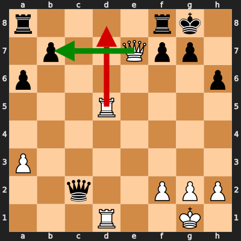

# Analysis: erivera90 vs Tobit240

**Date:** 2026.02.03 | **Event:** Live Chess | **Site:** Chess.com

Found **1** crucial moments where evaluation dropped significantly.

## Moment 1

**FEN:** `r4rk1/1p2Qpp1/p6p/3R4/8/P7/2q2PPP/3R2K1 w - - 0 25`

- **You Played:** **Rd8** ❌ (Red Arrow)
- **Engine Best:** **Qxb7** ✅ (Green Arrow)
- **Eval Swing:** -555 cp
- **Variation:** _Qxb7 Rfb8 Qd7 Rb6_

### Coach Explanation
Material loss. Rd8 loses the Queen for a Rook, while Qxb7 wins a pawn and maintains a significant material advantage with the Queen.

---

## 3 Key Takeaways

The recurring theme seems to be **Tactical Awareness and Material Valuation**. You need to better assess the immediate consequences of your moves, particularly regarding material exchanges.

Here's what you can focus on in your next game:

*   **Calculate Material Trades:** Before making a move, count the material being offered/taken and ensure you're coming out ahead (or at least not behind). Practice simple exchanges like Queen for Rook vs Queen for Pawn.
*   **Queen Safety:** Be extra cautious when moving your Queen. Always double-check if it's under attack or vulnerable to tactical combinations. Ask yourself, "Is my Queen safe here?".
*   **Prioritize Piece Activity:** Look for moves that improve the activity of your pieces (especially your Queen!) while simultaneously protecting them from danger.

Keep practicing and focusing on these areas – you'll see improvement in no time!

