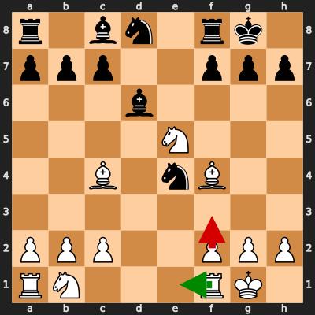
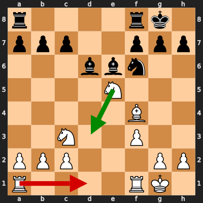
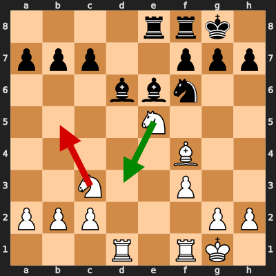
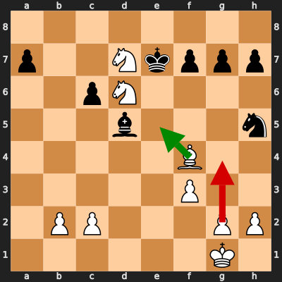
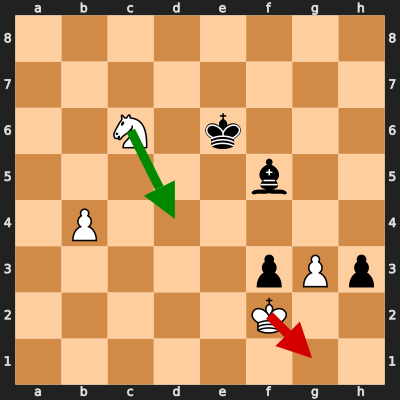
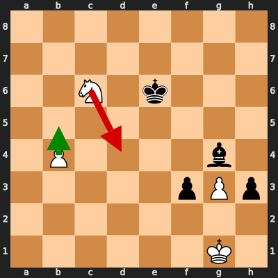
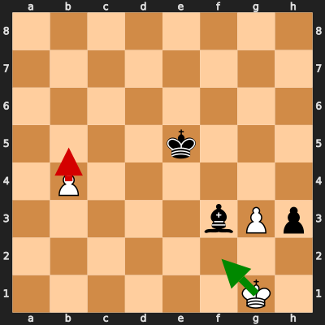
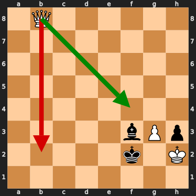

# Analysis: erivera90 vs estelle_leviosa

**Date:** 2026.02.03 | **Event:** Live Chess | **Site:** Chess.com

Found **8** crucial moments where evaluation dropped significantly.

## Moment 1

**FEN:** `r1bn1rk1/ppp2ppp/3b4/4N3/2B1nB2/8/PPP2PPP/RN3RK1 w - - 2 10`

- **You Played:** **f3** ❌ (Red Arrow)
- **Engine Best:** **Re1** ✅ (Green Arrow)
- **Eval Swing:** -279 cp
- **Variation:** _Re1 Bf5_

### Coach Explanation
The move f3 was a mistake because it weakens the kingside pawn structure unnecessarily and doesn't address the immediate threat posed by the Black knight on e4. Re1, on the other hand, is superior because it prepares to improve the position by developing the rook to a more active square and potentially connecting the rooks. Furthermore, it anticipates and prepares a defense against the developing threats like Bf5 suggested by Stockfish. By playing f3, white simply makes his position worse without gaining any tangible benefit, whereas Re1 is a developing move with a clear purpose and defensive value.

---
## Moment 2

**FEN:** `r4rk1/ppp2ppp/3bbn2/4N3/5B2/2N2P2/PPP3PP/R4RK1 w - - 0 13`

- **You Played:** **Rad1** ❌ (Red Arrow)
- **Engine Best:** **Nd3** ✅ (Green Arrow)
- **Eval Swing:** -273 cp
- **Variation:** _Nd3 Rad8_

### Coach Explanation
Okay, let's analyze this position.

The player's move, Rad1, is a mistake because it passively develops the rook without addressing the immediate threat posed by the opponent's pieces. The Stockfish evaluation drop suggests it significantly worsens White's position.

The engine's suggested move, Nd3, is superior because it directly addresses the pressure on the e5 knight and improves the knight's position. While it might seem like a simple defensive move, it prevents immediate tactical complications and aims to re-establish a more solid structure. Rad1 doesn't contribute to solving the immediate tactical problem. In other words, the player's move fails to react to the opponent's active pieces, while Nd3 is a proactive defensive step.

---
## Moment 3

**FEN:** `5k2/p4ppp/2pN4/3bN2n/5B2/5P2/1PP3PP/6K1 w - - 2 21`

- **You Played:** **Nd7+** ❌ (Red Arrow)
- **Engine Best:** **Be3** ✅ (Green Arrow)
- **Eval Swing:** -540 cp
- **Variation:** _Be3 g6 Ne4 Bxe4_

### Coach Explanation
Okay, here's the breakdown of why Nd7+ was a mistake in that position, and why Be3 is a better move:

*   **Nd7+ is a mistake because it leads to a significant material disadvantage.** According to Stockfish, it worsens the position by -540, indicating a dramatic shift in Black's favor. While it might look like a check, it doesn't achieve any lasting advantage and likely exposes the knight to capture or forces it to retreat to an even worse square.

*   **Be3 is superior because it improves the White position.** The move likely defends an important square, prepares a better position for the knight, and potentially develops pressure without sacrificing material. The continuation "Be3 g6 Ne4 Bxe4" suggests White can trade a Bishop for a knight, potentially improving pawn structure and/or relieving Black's control.

In essence, Nd7+ is a tactical blunder that doesn't achieve a strategic goal, while Be3 is a solid positional move that improves White's chances.

---
## Moment 4

**FEN:** `8/p2Nkppp/2pN4/3b3n/5B2/5P2/1PP3PP/6K1 w - - 4 22`

- **You Played:** **g4** ❌ (Red Arrow)
- **Engine Best:** **Be5** ✅ (Green Arrow)
- **Eval Swing:** -535 cp
- **Variation:** _Be5 Kxd7 Nb7 f6_

### Coach Explanation
Okay, let's analyze this. The player's move `g4` weakens the kingside pawn structure and does not address the immediate threat of the Black knight on h5 potentially causing problems. More importantly, it appears to simply be a wasted move.

The engine's suggested move `Be5` directly attacks the Black King and forces a response. This allows White to exploit the weakened Black position and possibly gain a decisive advantage by winning material. The fact that Black king will take the bishop allows white knight on d6 to jump to b7, attacking the rook. `Be5` is a tactical shot that actively creates pressure and generates opportunities, whereas `g4` does nothing beneficial.

---
## Moment 5

**FEN:** `8/8/2N1k3/5b2/1P6/5pPp/5K2/8 w - - 0 39`

- **You Played:** **Kg1** ❌ (Red Arrow)
- **Engine Best:** **Nd4+** ✅ (Green Arrow)
- **Eval Swing:** -435 cp
- **Variation:** _Nd4+ Kd5 Nxf3 Kc4_

### Coach Explanation
The player's move Kg1 is a mistake because it keeps the King passive and doesn't address the immediate threats and pressure. The engine's suggestion of Nd4+ is superior because it's a forcing move that improves the Knight's position while creating a check. This forces the Black King to react, potentially winning material or gaining a decisive advantage by getting the knight into the attack. Basically, Kg1 does nothing while Nd4+ is active and disruptive.

---
## Moment 6

**FEN:** `8/8/2N1k3/8/1P4b1/5pPp/8/6K1 w - - 2 40`

- **You Played:** **Nd4+** ❌ (Red Arrow)
- **Engine Best:** **b5** ✅ (Green Arrow)
- **Eval Swing:** -474 cp
- **Variation:** _b5 Kd5 Ne7+ Ke4_

### Coach Explanation
The move Nd4+ is a mistake because it allows the Black king to escape to a safer square and doesn't create any significant threat or advantage. The significantly negative evaluation change suggests it likely worsens White's position drastically, perhaps even leading to material loss or a quick checkmate.

The engine's suggestion, b5, is superior because it creates a passed pawn, forcing the Black king to deal with it. This restricts the king and allows White to potentially make progress and coordinate other pieces to exploit Black's weak pawn structure. The continuation provided shows that the b5 move will let White's Knight fork the King and Bishop.

---
## Moment 7

**FEN:** `8/8/8/4k3/1P6/5bPp/8/6K1 w - - 0 42`

- **You Played:** **b5** ❌ (Red Arrow)
- **Engine Best:** **Kf2** ✅ (Green Arrow)
- **Eval Swing:** -2869 cp
- **Variation:** _Kf2 h2 Ke3 Bd5_

### Coach Explanation
The move b5 is a terrible mistake because it does absolutely nothing to improve White's situation and walks into a deadly threat. The pawn advance does not create a threat and only serves to make White's position slightly worse, as it now has a weaker pawn structure. Stockfish identifies Kf2 as a better move because it is a waiting move that keeps white alive a bit longer. White is still losing but it prolongs the inevitable compared to b5.

---
## Moment 8

**FEN:** `1Q6/8/8/8/8/5bPp/5k1K/8 w - - 1 47`

- **You Played:** **Qb2+** ❌ (Red Arrow)
- **Engine Best:** **Qf4** ✅ (Green Arrow)
- **Eval Swing:** -2651 cp
- **Variation:** _Qf4 Ke2 Kxh3 Kf2_

### Coach Explanation
The player's move Qb2+ is a mistake because it allows the black king to escape to safety, ultimately failing to exploit the check and allowing Black to consolidate. The engine's move Qf4, however, keeps the king under pressure while simultaneously setting up a devastating attack along the f-file. Qf4 forces the king to move, and the continuation highlights the weakness on the h3 square, leading to White's attack breaking through. The player's move is a weak check that ultimately diffuses the attack, whereas the engine's move is a direct attack and aims to weaken the king.

---
