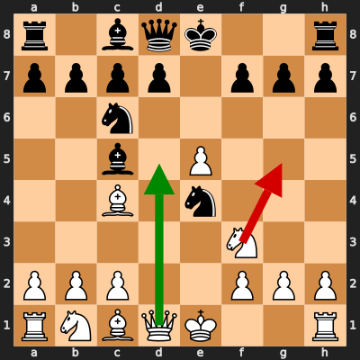
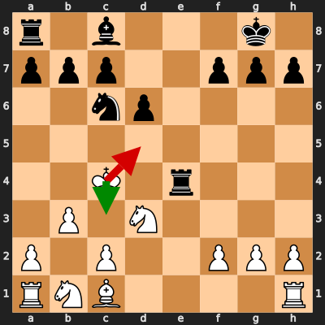

# Analysis: erivera90 vs ConTrasT_0

**Date:** 2026.02.04 | **Event:** Live Chess | **Site:** Chess.com

Found **2** crucial moments where evaluation dropped significantly.

## Moment 1

**FEN:** `r1bqk2r/pppp1ppp/2n5/2b1P3/2B1n3/5N2/PPP2PPP/RNBQK2R w KQkq - 2 6`

- **You Played:** **Ng5** ❌ (Red Arrow)
- **Engine Best:** **Qd5** ✅ (Green Arrow)
- **Eval Swing:** -750 cp
- **Variation:** _Qd5_

### Coach Explanation
Ng5 weakens the pawn structure and allows Black to capitalize on the exposed King. Qd5 immediately attacks the weak f7 pawn and forces Black into a difficult defensive position.

---
## Moment 2

**FEN:** `r1b3k1/ppp2ppp/2np4/8/2K1r3/1P1N4/P1P2PPP/RNB4R w - - 4 16`

- **You Played:** **Kd5** ❌ (Red Arrow)
- **Engine Best:** **Kc3** ✅ (Green Arrow)
- **Eval Swing:** -10314 cp
- **Variation:** _Kc3 Bf5 Na3 Rae8_

### Coach Explanation
Analysis unavailable due to LLM error.

---

## 3 Key Takeaways

It seems your primary challenge lies in identifying and exploiting immediate tactical opportunities. While Ng5 seems like an aggressive move, it weakened your king's safety and allowed your opponent counterplay. You missed a golden opportunity with Qd5!

Here's what to focus on next game:

*   **Look for immediate threats:** Before making a move, ask yourself, "Am I attacking anything? Am I defending everything?". Always consider direct attacks first.
*   **Evaluate the consequences of pawn moves:** Pawns can be weaknesses as much as strengths. Think carefully about how pawn moves affect your king's safety and the structure of the board.
*   **Prioritize active moves:** Seek out moves that directly threaten your opponent or improve the position of your pieces. Don't be afraid to be bold and proactive!

