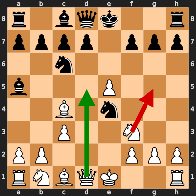
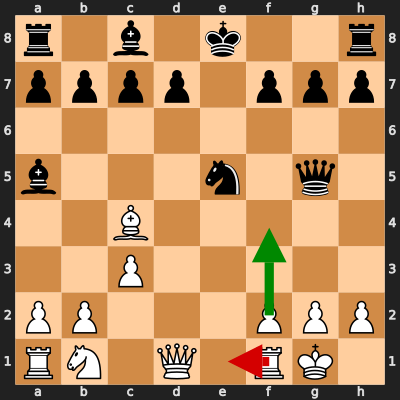
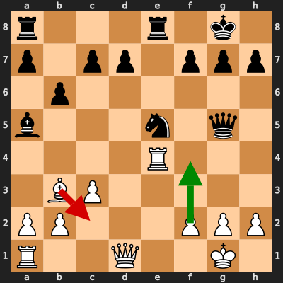
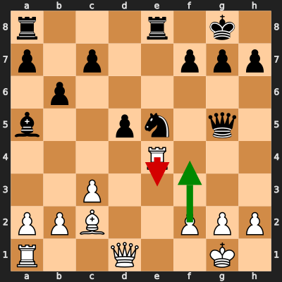
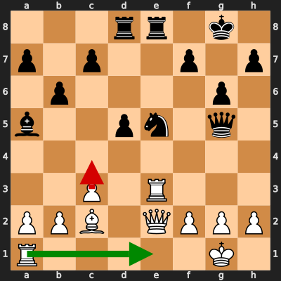

# Analysis: erivera90 vs Victissui

**Date:** 2026.02.04 | **Event:** Live Chess | **Site:** Chess.com

Found **5** crucial moments where evaluation dropped significantly.

## Moment 1

**FEN:** `r1bqk2r/pppp1ppp/2n5/b3P3/2B1n3/2P2N2/PP3PPP/RNBQK2R w KQkq - 0 7`

- **You Played:** **Ng5** ❌ (Red Arrow)
- **Engine Best:** **Qd5** ✅ (Green Arrow)
- **Eval Swing:** -807 cp
- **Variation:** _Qd5 O-O Qxe4 h6_

### Coach Explanation
Ng5 is a blunder because it hangs the knight, walking directly into a discovered attack on the queen and allows black to consolidate. Qd5 immediately develops the queen to a central square, attacks the knight on e4, and prepares to castle after black's response.

---
## Moment 2

**FEN:** `r1b1k2r/pppp1ppp/8/b3n1q1/2B5/2P5/PP3PPP/RN1Q1RK1 w kq - 0 10`

- **You Played:** **Re1** ❌ (Red Arrow)
- **Engine Best:** **f4** ✅ (Green Arrow)
- **Eval Swing:** -337 cp
- **Variation:** _f4 Qg4 Be2 Bb6+_

### Coach Explanation
Development. Re1 passively develops the rook into a pin, while the immediate threat is Qxg2 checkmate. f4 directly challenges the Black Queen and opens lines for White's pieces while preventing the immediate checkmate threat.

---
## Moment 3

**FEN:** `r3r1k1/p1pp1ppp/1p6/b3n1q1/4R3/1BP5/PP3PPP/R2Q2K1 w - - 1 15`

- **You Played:** **Bc2** ❌ (Red Arrow)
- **Engine Best:** **f4** ✅ (Green Arrow)
- **Eval Swing:** -259 cp
- **Variation:** _f4_

### Coach Explanation
Bc2 loses tempo and allows Black to consolidate their attack, worsening White's already precarious position. f4 challenges Black's central control, disrupts the coordination of the Black pieces, and opens lines for White's attack, thus offering better chances of fighting back.

---
## Moment 4

**FEN:** `r3r1k1/p1p2ppp/1p6/b2pn1q1/4R3/2P5/PPB2PPP/R2Q2K1 w - - 0 16`

- **You Played:** **Re3** ❌ (Red Arrow)
- **Engine Best:** **f4** ✅ (Green Arrow)
- **Eval Swing:** -252 cp
- **Variation:** _f4 Nf3+ Kh1 Qh5_

### Coach Explanation
Re3 worsens the position, losing significant material and initiative. f4 creates counterplay by attacking the knight, potentially relieving pressure and developing an attack.

---
## Moment 5

**FEN:** `3rr1k1/p1p2p1p/1p4p1/b2pn1q1/8/2P1R3/PPB1QPPP/R5K1 w - - 0 18`

- **You Played:** **c4** ❌ (Red Arrow)
- **Engine Best:** **Re1** ✅ (Green Arrow)
- **Eval Swing:** -329 cp
- **Variation:** _Re1 f6_

### Coach Explanation
Pawn advance. c4 worsens the position by further weakening the pawn structure and failing to address the immediate threat of the active Black pieces, resulting in a significant evaluation drop. Re1 is superior as it consolidates the defense by improving rook activity and preparing for a potential attack, maintaining a more stable position.

---

## 3 Key Takeaways

It appears a recurring theme in your game was **failing to address immediate threats and prioritize active piece play**. You often chose moves that passively defended or weakened your pawn structure instead of proactively challenging your opponent and developing your pieces.

Here's what you can focus on in your next game:

*   **Calculate Threats First:** Before making a move, always identify the most immediate threats from your opponent. What are they trying to achieve? How can you neutralize it?
*   **Prioritize Active Development:** Aim to develop your pieces to active squares where they control important central areas and threaten your opponent. Don't be afraid to challenge the center and create opportunities.
*   **Look for Counterplay:** When under pressure, don't just defend passively. Actively look for ways to create counterplay by attacking key enemy pieces or pawns, even if it seems risky. This can relieve pressure and create opportunities for you.

Keep practicing and remember that every game is a learning experience!

