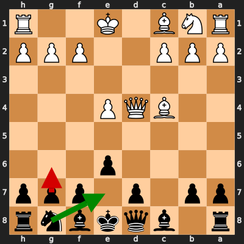
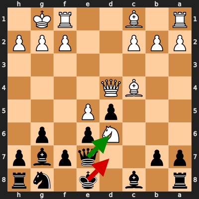
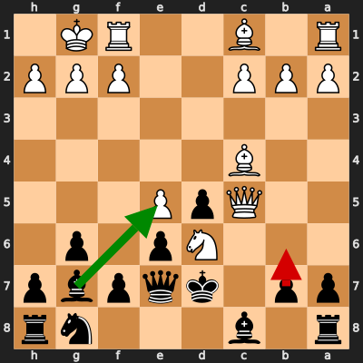
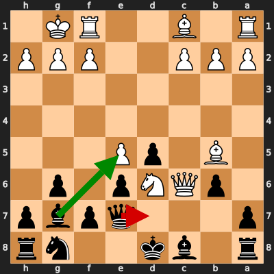
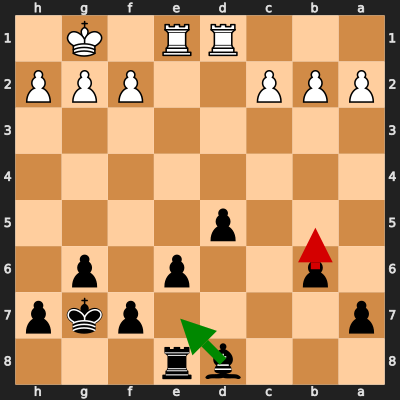
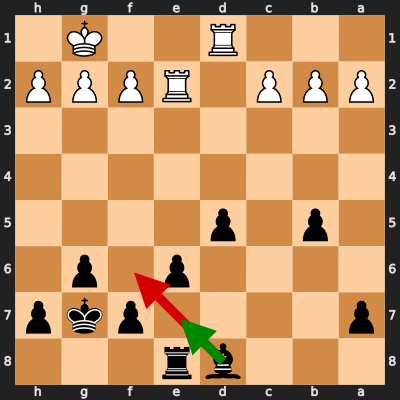
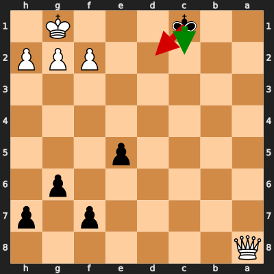
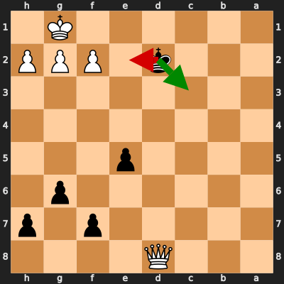

# Analysis: skiddyrax vs erivera90

**Date:** 2026.02.04 | **Event:** Live Chess | **Site:** Chess.com

Found **9** crucial moments where evaluation dropped significantly.

## Moment 1

**FEN:** `r1bqkbnr/pp1p1ppp/4p3/8/2BQP3/8/PPP2PPP/RNB1K2R b KQkq - 0 6`

- **You Played:** **g6** ❌ (Red Arrow)
- **Engine Best:** **Ne7** ✅ (Green Arrow)
- **Eval Swing:** -535 cp
- **Variation:** _Ne7 O-O Nc6 Qc3_

### Coach Explanation
Pawn structure. g6 weakens the kingside prematurely and does little to improve Black's position, worsening the evaluation significantly. Ne7 develops a piece towards the center, prepares potential kingside castling, and the subsequent Nc6 eyes the center more effectively, leading to a more solid position.

---
## Moment 2

**FEN:** `r1b1k1nr/pp2qpbp/3Np1p1/3pP3/2BQ4/8/PPP2PPP/R1B2RK1 b kq - 1 11`

- **You Played:** **Kd7** ❌ (Red Arrow)
- **Engine Best:** **Qxd6** ✅ (Green Arrow)
- **Eval Swing:** -851 cp
- **Variation:** _Qxd6 Bb5+ Bd7 Re1_

### Coach Explanation
King safety is paramount. Kd7 loses significant material, worsening Black's already precarious position. Qxd6 immediately wins a piece, forcing White to respond to the threat.

---
## Moment 3

**FEN:** `r1b3nr/pp1kqpbp/3Np1p1/2QpP3/2B5/8/PPP2PPP/R1B2RK1 b - - 3 12`

- **You Played:** **b6** ❌ (Red Arrow)
- **Engine Best:** **Bxe5** ✅ (Green Arrow)
- **Eval Swing:** -430 cp
- **Variation:** _Bxe5 Bb5+ Kd8 Nxf7+_

### Coach Explanation
"b6" is a positional error that allows White to maintain pressure and further develop. "Bxe5" immediately exploits the undefended Bishop on c4 and leads to a strong attack after Bb5+, regaining the material and attacking the Black king.

---
## Moment 4

**FEN:** `r1bk2nr/p3qpbp/1pQNp1p1/1B1pP3/8/8/PPP2PPP/R1B2RK1 b - - 3 14`

- **You Played:** **Qd7** ❌ (Red Arrow)
- **Engine Best:** **Bxe5** ✅ (Green Arrow)
- **Eval Swing:** -452 cp
- **Variation:** _Bxe5 Nxf7+ Qxf7 Qxa8_

### Coach Explanation
Qd7 worsens Black's position due to passivity. Bxe5 immediately challenges White's strong center, initiating a tactical sequence (Nxf7+ Qxf7 Qxa8) that wins a rook and equalizes.

---
## Moment 5

**FEN:** `3br3/p4pkp/1p2p1p1/3p4/8/8/PPP2PPP/3RR1K1 b - - 1 26`

- **You Played:** **b5** ❌ (Red Arrow)
- **Engine Best:** **Be7** ✅ (Green Arrow)
- **Eval Swing:** -272 cp
- **Variation:** _Be7_

### Coach Explanation
Pawn push b5 weakens the pawn structure, creates a potential target, and doesn't address the underlying issues. Be7 develops the bishop to a more active square, improves the Black's position defensively and prepares potential counterplay along the long diagonal.

---
## Moment 6

**FEN:** `3br3/p4pkp/4p1p1/1p1p4/8/8/PPP1RPPP/3R2K1 b - - 1 27`

- **You Played:** **Bf6** ❌ (Red Arrow)
- **Engine Best:** **Be7** ✅ (Green Arrow)
- **Eval Swing:** -276 cp
- **Variation:** _Be7 Rd3_

### Coach Explanation
Bf6 weakens the pawn structure and allows White to consolidate, worsening Black's position. Be7 maintains a better defensive structure and prevents White from improving as easily.

---
## Moment 7

**FEN:** `3r4/5pkp/4pbp1/p2p4/2P5/8/P2R1PPP/3R2K1 b - - 0 31`

- **You Played:** **dxc4** ❌ (Red Arrow)
- **Engine Best:** **Bc3** ✅ (Green Arrow)
- **Eval Swing:** -505 cp
- **Variation:** _Bc3 Rc2 d4 Kf1_

### Coach Explanation
Pawn structure. dxc4 worsens Black's pawn structure, opening lines for White's rooks while offering little tangible gain. Bc3, however, develops a piece, attacks the rook, and creates threats along the diagonal, forcing White to react defensively.

---
## Moment 8

**FEN:** `Q7/5p1p/6p1/4p3/8/8/5PPP/2k3K1 b - - 0 43`

- **You Played:** **Kd2** ❌ (Red Arrow)
- **Engine Best:** **Kc2** ✅ (Green Arrow)
- **Eval Swing:** -3262 cp
- **Variation:** _Kc2 Qe4+ Kd1 Kf1_

### Coach Explanation
King's move Kd2 is a blunder because it allows the Queen to deliver a check and rapidly force mate. Kc2, however, keeps the King closer to the queen allowing more survival time.

---
## Moment 9

**FEN:** `3Q4/5p1p/6p1/4p3/8/8/3k1PPP/6K1 b - - 2 44`

- **You Played:** **Ke2** ❌ (Red Arrow)
- **Engine Best:** **Kc3** ✅ (Green Arrow)
- **Eval Swing:** -3251 cp
- **Variation:** _Kc3 f3 Kc4 Qd6_

### Coach Explanation
King movement. Ke2 walks into a forced draw with the queen, whereas Kc3 delays the draw and forces White to find the correct defense. Ke2 immediately allows White to force a stalemate, wasting Black's winning chances.

---

## 3 Key Takeaways

It appears a recurring theme in your game was **weakening your pawn structure and overlooking immediate tactical opportunities.** You sometimes made moves that passively defended instead of actively improving your position and creating threats.

Here's what you can focus on in your next game:

*   **Prioritize active piece development and tactical vision:** Before moving a pawn, consider if it creates weaknesses. Always look for hanging pieces and forcing moves like checks, captures, and threats. Ask yourself "What does this move *do*? Is it putting pressure on my opponent?"
*   **King Safety First:** Be extremely mindful of your King's position, especially when making pawn moves in front of it. Before making a move, quickly assess if it compromises king safety or opens lines of attack for your opponent.
*   **Don't shy away from exchanges:** Look for opportunities to trade pieces, especially if it simplifies the position, opens lines for your rooks, or challenges your opponent's central control. Calculating the consequences of trades can lead to tactical breakthroughs!

