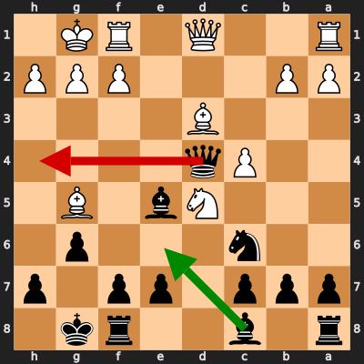
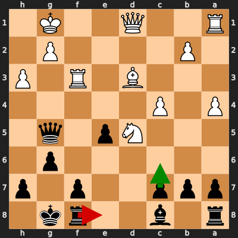

# Analysis: Akane0714 vs erivera90

**Date:** 2026.02.05 | **Event:** Live Chess | **Site:** Chess.com

Found **3** crucial moments where evaluation dropped significantly.

## Moment 1

**FEN:** `r1b2rk1/ppp1pp1p/2n3p1/3Nb1B1/2Pq4/3B4/PP3PPP/R2Q1RK1 b - - 5 12`

- **You Played:** **Qh4** ❌ (Red Arrow)
- **Engine Best:** **Be6** ✅ (Green Arrow)
- **Eval Swing:** -815 cp
- **Variation:** _Be6 Qb3 Rfd8 Be3_

### Coach Explanation
Tactics. Qh4 is a blunder because it allows White to consolidate and develop with tempo, further exposing Black's King. Be6 improves Black's position by developing a piece, controlling key squares, and preparing to castle. You were objectively lost here, but this move might have set a practical trap.

---
## Moment 2

**FEN:** `r1b2rk1/ppp1pp1p/6p1/6q1/P1Pn1N2/3B3P/1P4P1/R2Q1RK1 b - - 0 16`

- **You Played:** **Nf3+** ❌ (Red Arrow)
- **Engine Best:** **e5** ✅ (Green Arrow)
- **Eval Swing:** -647 cp
- **Variation:** _e5 Nd5 Bxh3 Rf2_

### Coach Explanation
Nf3+ is a blunder because it throws away a piece while offering no tangible benefit. You were objectively lost here, but this move might have set a practical trap. e5 is superior because it develops a pawn, challenges the center, and prepares to activate the Black pieces with Nd5.

---
## Moment 3

**FEN:** `r1b2rk1/ppp2p1p/6p1/3Np1q1/P1P5/3B1R1P/1P4P1/R2Q2K1 b - - 1 18`

- **You Played:** **Re8** ❌ (Red Arrow)
- **Engine Best:** **c6** ✅ (Green Arrow)
- **Eval Swing:** -307 cp
- **Variation:** _c6 Nf6+ Kg7 Qe2_

### Coach Explanation
Rook e8 weakens your position considerably. You were objectively lost here, but this move *might* have set a practical trap. c6, on the other hand, improves your pawn structure and challenges White's central control, leading to a slightly better defensive setup, according to the engine.

---

## 3 Key Takeaways

Your performance shows a tendency to make moves that either weaken your position significantly or throw away material, sometimes seemingly in the hope of setting a trap. While the idea of setting traps isn't bad, it's important to prioritize solid positional play and piece development first.

Here's what you can focus on in your next game:

*   **Prioritize Development:** Before making aggressive moves, ensure all your pieces are actively participating in the game. Look for opportunities to bring them out to good squares, especially in the opening.
*   **Strengthen Your Position First:** Avoid moves that weaken your pawn structure or unnecessarily expose your king. Focus on solidifying your position and controlling key squares before launching an attack.
*   **Calculate Before Sacrificing:** Ensure any piece sacrifice is well-calculated and leads to a clear advantage, not just a potential trap. Don't throw away material unless you're absolutely sure it will pay off.

