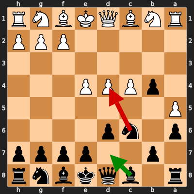
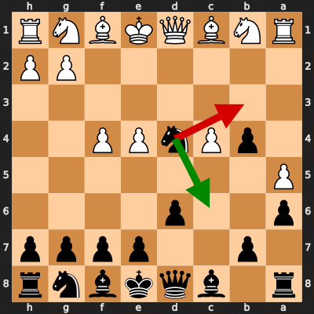

# Analysis: ChessMood_Champion vs erivera90

**Date:** 2026.02.05 | **Event:** Live Chess | **Site:** Chess.com

Found **2** crucial moments where evaluation dropped significantly.

## Moment 1

**FEN:** `r1bqkbnr/1p2pppp/p1np4/P7/1pPPP3/8/5PPP/RNBQKBNR b KQkq - 0 6`

- **You Played:** **Nxd4** ❌ (Red Arrow)
- **Engine Best:** **Bd7** ✅ (Green Arrow)
- **Eval Swing:** -414 cp
- **Variation:** _Bd7 Nf3 e5 Nbd2_

### Coach Explanation
Nxd4 sacrifices a pawn and opens the position for White's development. Bd7, however, maintains a solid defensive structure, prepares development, and avoids immediate tactical complications. You were objectively lost here, but this move might have set a practical trap.

---
## Moment 2

**FEN:** `r1bqkbnr/1p2pppp/p2p4/P7/1pPnPP2/8/6PP/RNBQKBNR b KQkq - 0 7`

- **You Played:** **Nb3** ❌ (Red Arrow)
- **Engine Best:** **Nc6** ✅ (Green Arrow)
- **Eval Swing:** -532 cp
- **Variation:** _Nc6 Nf3 g6 Bb2_

### Coach Explanation
Knight development. Nb3 loses significant tempo and allows White to consolidate their position. Nc6 develops a piece to a more active square, controls central squares, and prepares for further development, maintaining a solid position. You were objectively lost here, but this move might have set a practical trap.

---

## 3 Key Takeaways

Your game analysis reveals a recurring theme of **prioritizing complex tactical ideas over solid fundamental development and positional understanding.** While looking for traps is creative, it's important to first establish a strong foundation.

Here's what you can focus on in your next game:

*   **Prioritize Development:** Focus on bringing your pieces out to active squares early in the game before considering tactical sacrifices. Aim to control the center and connect your rooks.
*   **Solidify Your Structure:** Before launching an attack, ensure your pawn structure is sound and protects your king. Avoid moves that weaken your position unnecessarily.
*   **Think Before Sacrificing:** Evaluate sacrifices carefully. Are you gaining sufficient compensation (development, open lines, attack on the king) for the material you're giving up? Often, a solid position is better than a risky attack.

