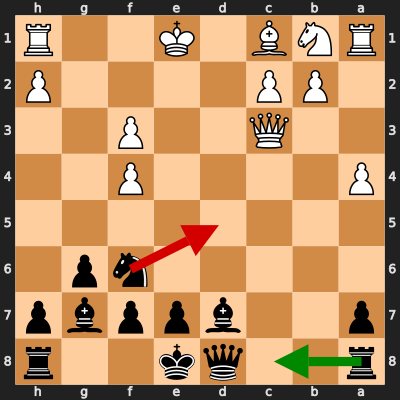
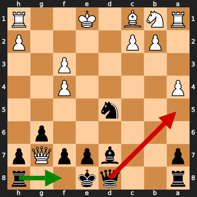
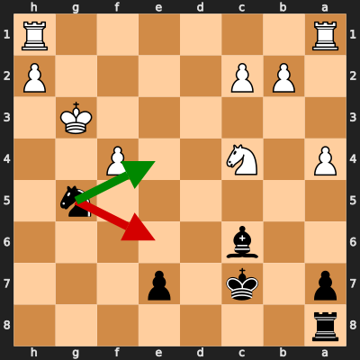
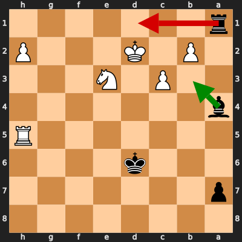

# Analysis: yantradd vs erivera90

**Date:** 2026.02.05 | **Event:** Live Chess | **Site:** Chess.com

Found **4** crucial moments where evaluation dropped significantly.

## Moment 1

**FEN:** `r2qk2r/p2bppbp/5np1/8/P4P2/2Q2P2/1PP4P/RNB1K2R b KQkq - 0 12`

- **You Played:** **Nd5** ❌ (Red Arrow)
- **Engine Best:** **Rc8** ✅ (Green Arrow)
- **Eval Swing:** -656 cp
- **Variation:** _Rc8 Qd2 Qb6 a5_

### Coach Explanation
Nd5 is a tactical blunder. The move develops the knight, but it weakens the pawn structure and allows White to gain a significant advantage. Rc8, on the other hand, prepares to develop the rook to a more active position, controlling the open c-file and supporting the queenside.

---
## Moment 2

**FEN:** `r2qk2r/p2bppQp/6p1/3n4/P4P2/5P2/1PP4P/RNB1K2R b KQkq - 0 13`

- **You Played:** **Qa5+** ❌ (Red Arrow)
- **Engine Best:** **Rf8** ✅ (Green Arrow)
- **Eval Swing:** -589 cp
- **Variation:** _Rf8 Qd4_

### Coach Explanation
Qa5+ is a mistake because it allows White to consolidate and develop, worsening Black's already difficult position. Rf8 is superior as it develops a piece to a safe square, preparing for defense and potential counterplay instead of a check easily dealt with.

---
## Moment 3

**FEN:** `r7/p1k1p3/2b5/6n1/P1N2P2/6K1/1PP4P/R6R b - - 0 24`

- **You Played:** **Ne6** ❌ (Red Arrow)
- **Engine Best:** **Ne4+** ✅ (Green Arrow)
- **Eval Swing:** -391 cp
- **Variation:** _Ne4+ Kf3 Nd6+ Ke2_

### Coach Explanation
Activity. Ne6 is a mistake because it allows White to consolidate. Ne4+ forces the King to move and allows Black to recapture the initiative with a check.

---
## Moment 4

**FEN:** `8/p7/3k4/7R/b7/2P1N3/1P1K3P/r7 b - - 0 45`

- **You Played:** **Rd1+** ❌ (Red Arrow)
- **Engine Best:** **Bb3** ✅ (Green Arrow)
- **Eval Swing:** -386 cp
- **Variation:** _Bb3_

### Coach Explanation
Check with Rd1+ loses tempo and allows White's king to escape to safety, further consolidating White's advantage. Bb3, conversely, restricts the king and maintains pressure, preventing White from improving their position and prolonging the defensive task.

---

## 3 Key Takeaways

The recurring theme in your errors is **a tendency to make moves that appear active but ultimately weaken your position and cede initiative to your opponent.** You sometimes prioritize development that isn't strategically sound or checks that don't lead to concrete advantages, allowing White to consolidate and improve their position.

Here are three pieces of advice to focus on in your next game:

*   **Evaluate the Long-Term Consequences:** Before making a move that seems active, deeply consider how it impacts your pawn structure, piece activity for both you and your opponent, and overall control of the board. Don't just react; plan.
*   **Prioritize Sound Development:** Focus on developing your pieces to active and safe squares that support a broader strategic plan. A good development move is often better than a superficial check or attack.
*   **Value Initiative:** Recognize when you can force your opponent to react and maintain the initiative. Consider moves that create threats or force the king to move, rather than moves that are easily countered. You got this!

