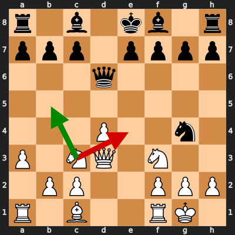
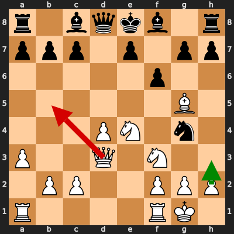
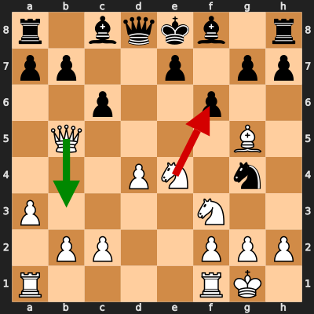
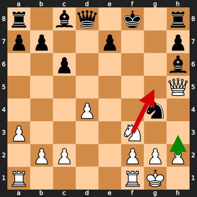
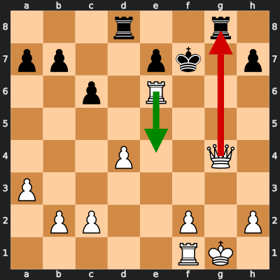
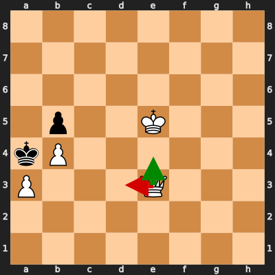

# Analysis: erivera90 vs Nasrclass

**Date:** 2026.02.06 | **Event:** Live Chess | **Site:** Chess.com

Found **6** crucial moments where evaluation dropped significantly.

## Moment 1

**FEN:** `r1b1kb1r/ppp1pppp/3q4/8/3P2n1/P1NQ1N2/1PP2PPP/R1B2RK1 w kq - 1 10`

- **You Played:** **Ne4** ❌ (Red Arrow)
- **Engine Best:** **Nb5** ✅ (Green Arrow)
- **Eval Swing:** -281 cp
- **Variation:** _Nb5 Qd8 Bf4 e5_

### Coach Explanation
Ne4 weakens the pawn structure and allows Black to gain initiative. Nb5 immediately pressures Black's queen, forcing a response and developing with tempo while Bf4 continues development and prepares to control the center.

---
## Moment 2

**FEN:** `r1bqkb1r/ppp1p1pp/5p2/6B1/3PN1n1/P2Q1N2/1PP2PPP/R4RK1 w kq - 0 12`

- **You Played:** **Qb5+** ❌ (Red Arrow)
- **Engine Best:** **h3** ✅ (Green Arrow)
- **Eval Swing:** -382 cp
- **Variation:** _h3 h5 Rfe1 Nh6_

### Coach Explanation
Queen check Qb5+ loses significant tempo, allowing Black to consolidate. h3 develops a pawn, improves pawn structure, and prepares to blunt Black's attack with ...Nh6 and ...h5, thus maintaining a more stable position.

---
## Moment 3

**FEN:** `r1bqkb1r/pp2p1pp/2p2p2/1Q4B1/3PN1n1/P4N2/1PP2PPP/R4RK1 w kq - 0 13`

- **You Played:** **Nxf6+** ❌ (Red Arrow)
- **Engine Best:** **Qb3** ✅ (Green Arrow)
- **Eval Swing:** -394 cp
- **Variation:** _Qb3 Qd5 h3 fxg5_

> **⚠️ CRITICAL: Your move allowed the opponent to immediately capture your White Knight on f6.**

### Coach Explanation
BLUNDER: You hung your Knight. The opponent can simply take it with gxf6. Qb3 develops the Queen to a more active square and prepares threats along the b-file while avoiding immediate material loss.

---
## Moment 4

**FEN:** `r1bq1k1r/pp2p2p/2p4b/7Q/3P2n1/P4N2/1PP2PPP/R4RK1 w - - 3 17`

- **You Played:** **Ng5** ❌ (Red Arrow)
- **Engine Best:** **h3** ✅ (Green Arrow)
- **Eval Swing:** -310 cp
- **Variation:** _h3 Qd5 Qh4 Rg8_

> **⚠️ CRITICAL: Your move allowed the opponent to immediately capture your White Knight on g5.**

### Coach Explanation
BLUNDER: You hung your Knight. The opponent can simply take it with Bxg5. h3 prevents immediate material loss, improving your position slightly by preventing the knight from being immediately captured, and leading to the suggested continuation.

---
## Moment 5

**FEN:** `3r2r1/pp2pk1p/2p1R3/8/3P2Q1/P7/1PP2P1P/5RK1 w - - 3 26`

- **You Played:** **Qxg8+** ❌ (Red Arrow)
- **Engine Best:** **Re4** ✅ (Green Arrow)
- **Eval Swing:** -559 cp
- **Variation:** _Re4 Rxg4+ Rxg4 c5_

> **⚠️ CRITICAL: Your move allowed the opponent to immediately capture your White Queen on g8.**

### Coach Explanation
BLUNDER: You hung your Queen. The opponent can simply take it with Rxg8. Re4 forces the opponent to react while maintaining material advantage and attacking potential.

---
## Moment 6

**FEN:** `8/8/8/1p2K3/kP6/P3Q3/8/8 w - - 2 59`

- **You Played:** **Qd3** ❌ (Red Arrow)
- **Engine Best:** **Qe4** ✅ (Green Arrow)
- **Eval Swing:** -10000 cp
- **Variation:** _Qe4 Kb3 Kd4 Kb2_

### Coach Explanation
Queen activity. Qd3 achieves nothing and allows the king to escape the mating net. Qe4 forces the black king back and maintains mating threats.

---

## 3 Key Takeaways

Your game shows a tendency to make moves that weaken your position and/or allow your opponent to gain the initiative. A recurring theme is premature attacks that ultimately lose tempo and hanging pieces.

Here's what to focus on in your next game:

*   **Prioritize Piece Safety:** Before making a move, always double-check that the piece you're moving is not under immediate attack. Look for hanging pieces on both sides.
*   **Develop with Purpose:** Ensure your moves not only develop your pieces but also control important squares, threaten the opponent, or support your pawn structure. Ask yourself "What does this move *do*?"
*   **Calculate Before Attacking:** Before launching an attack, calculate the consequences. Will you gain material, force a weakness, or improve your position? Avoid attacks that are easily defended or leave you worse off.

