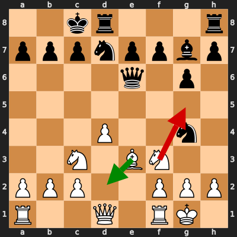

# Analysis: erivera90 vs Thomas62Neumann

**Date:** 2026.02.07 | **Event:** Live Chess | **Site:** Chess.com

Found **1** crucial moments where evaluation dropped significantly.

## Moment 1

**FEN:** `2kr3r/pppnppbp/4q1p1/8/3P2n1/2N1BN2/PPP2PPP/R2Q1RK1 w - - 3 11`

- **You Played:** **Ng5** ❌ (Red Arrow)
- **Engine Best:** **Bd2** ✅ (Green Arrow)
- **Eval Swing:** -295 cp
- **Variation:** _Bd2 Rhe8 Re1 Qc4_

> **⚠️ CRITICAL: Your move allowed the opponent to immediately capture your White Bishop on e3.**

### Coach Explanation
BLUNDER: You hung your Bishop. The opponent can simply take it with Nxe3.

Ng5 is a tactical error because it allows Nxe3, winning a piece. Bd2 defends the Bishop while preparing to develop further, solidifying the position. The engine's preferred move prioritizes piece safety and development over immediate tactical "opportunities" that leave you vulnerable.

---

## 3 Key Takeaways

The recurring theme of your error in this game seems to be **tactical oversight when pursuing aggressive plays**. You're looking for active moves, which is great, but not ensuring your pieces are safe and the position is sound *before* launching into those moves.

Here's what you can focus on next game:

*   **Piece Safety First:** Before committing to an attack or a "clever" move, double-check if any of your pieces are undefended or vulnerable to immediate capture.
*   **Evaluate All Exchanges:** Before making a tactical move, consider all possible replies by your opponent and whether they lead to a favorable exchange for you. Ask yourself "What if they just take it?"
*   **Solidify Before Attacking:** Prioritize developing your pieces to good squares and solidifying your position *before* launching into an attack. Patience can pay off!

