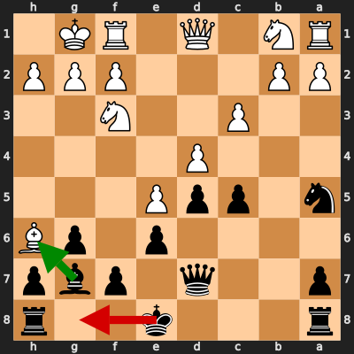
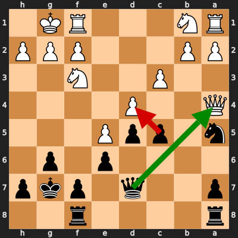

# Analysis: Shminicricket vs erivera90

**Date:** 2026.02.09 | **Event:** Live Chess | **Site:** Chess.com

Found **2** crucial moments where evaluation dropped significantly.

## Moment 1

**FEN:** `r3k2r/p2q1pbp/4p1pB/n1ppP3/3P4/2P2N2/PP3PPP/RN1Q1RK1 b kq - 0 13`

- **You Played:** **O-O** ❌ (Red Arrow)
- **Engine Best:** **Bxh6** ✅ (Green Arrow)
- **Eval Swing:** -316 cp
- **Variation:** _Bxh6 dxc5 O-O Re1_

> **⚠️ CRITICAL: Your move allowed the opponent to immediately capture your Black Bishop on g7.**

### Coach Explanation
BLUNDER: You hung your Bishop. The opponent can simply take it with Bxh6. Castling was irrelevant and allowed a free piece for the opponent. Bxh6 forces a trade, preventing material loss and developing Black's position.

---
## Moment 2

**FEN:** `r4r2/p2q1pkp/4p1p1/n1ppP3/Q2P4/2P2N2/PP3PPP/RN3RK1 b - - 1 15`

- **You Played:** **cxd4** ❌ (Red Arrow)
- **Engine Best:** **Qxa4** ✅ (Green Arrow)
- **Eval Swing:** -1393 cp
- **Variation:** _Qxa4 b3 Nxb3 axb3_

> **⚠️ CRITICAL: Your move allowed the opponent to immediately capture your Black Queen on d7.**

### Coach Explanation
BLUNDER: You hung your Queen. The opponent can simply take it with Qxa7. Your move cxd4 walks into this. Qxa4 forces the exchange, salvaging some material instead of outright losing the Queen.

---

## 3 Key Takeaways

The recurring theme in your mistakes is **overlooking immediate threats and tactical vulnerabilities**. You're focusing on your own plans but not adequately checking what your opponent can do in response.

Here's some advice for your next game:

*   **Before each move, do a "threat check":** Ask yourself "What pieces of mine are undefended? What squares are weak around my King? What can my opponent take immediately?".
*   **Always consider captures:** Before making a move, quickly scan the board for any potential captures, both for you and against you. Think "Can I take something? Can they take something?".
*   **Don't be afraid to trade material when necessary:** Sometimes, giving up a piece to avoid a greater loss (like the Queen!) is the best option. Focus on minimizing damage.

Keep practicing! Identifying these areas is the first step to improvement.

