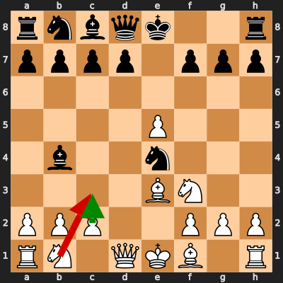
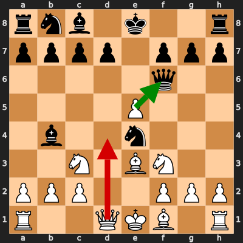
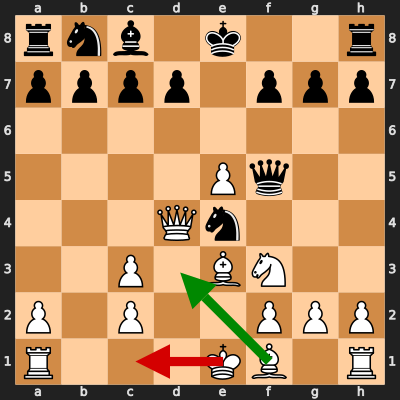
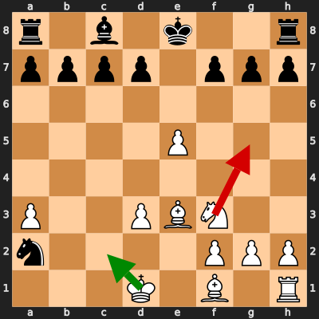
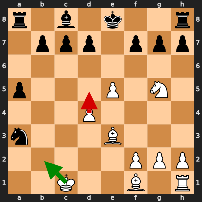

# Analysis: erivera90 vs Ryanamor

**Date:** 2026.02.10 | **Event:** Live Chess | **Site:** Chess.com

Found **5** crucial moments where evaluation dropped significantly.

## Moment 1

**FEN:** `rnbqk2r/pppp1ppp/8/4P3/1b2n3/4BN2/PPP2PPP/RN1QKB1R w KQkq - 3 6`

- **You Played:** **Nc3** ❌ (Red Arrow)
- **Engine Best:** **c3** ✅ (Green Arrow)
- **Eval Swing:** -351 cp
- **Variation:** _c3 Be7_

> **⚠️ CRITICAL: Your move allowed the opponent to immediately capture your White Knight on c3.**

### Coach Explanation
BLUNDER: You hung your Knight. The opponent can simply take it with Nxc3. Nc3 develops a piece into immediate danger. c3, while passive, defends the pawn and does not offer a free piece.

---
## Moment 2

**FEN:** `rnb1k2r/pppp1ppp/5q2/4P3/1b2n3/2N1BN2/PPP2PPP/R2QKB1R w KQkq - 5 7`

- **You Played:** **Qd4** ❌ (Red Arrow)
- **Engine Best:** **exf6** ✅ (Green Arrow)
- **Eval Swing:** -452 cp
- **Variation:** _exf6 Nxc3 Qd4 Nc6_

> **⚠️ CRITICAL: Your move allowed the opponent to immediately capture your White Knight on c3.**

### Coach Explanation
BLUNDER: You hung your Knight. The opponent can simply take it with Nxc3. exf6 opens the e-file and removes the Queen's pressure, while your Queen move allows a free piece.

---
## Moment 3

**FEN:** `rnb1k2r/pppp1ppp/8/4Pq2/3Qn3/2P1BN2/P1P2PPP/R3KB1R w KQkq - 1 9`

- **You Played:** **O-O-O** ❌ (Red Arrow)
- **Engine Best:** **Bd3** ✅ (Green Arrow)
- **Eval Swing:** -383 cp
- **Variation:** _Bd3 Nc6 Qxe4 Qxe4_

### Coach Explanation
Castling queenside weakens the king's position given the open files and active black pieces while developing the Bishop to d3 supports the e5 pawn, prepares to control the center, and leads to a favorable exchange after Qxe4.

---
## Moment 4

**FEN:** `r1b1k2r/pppp1ppp/8/4P3/8/P2PBN2/n4PPP/3K1B1R w kq - 1 15`

- **You Played:** **Ng5** ❌ (Red Arrow)
- **Engine Best:** **Kc2** ✅ (Green Arrow)
- **Eval Swing:** -480 cp
- **Variation:** _Kc2_

### Coach Explanation
Ng5 abandons central control and allows Black significant initiative. Kc2 consolidates the King's safety and prepares for a more stable defense despite being down material. You were objectively lost here, but this move might have set a practical trap.

---
## Moment 5

**FEN:** `r1b1k2r/1ppp1ppp/8/p3P1N1/3P4/n3B3/5PPP/2K2B1R w kq - 0 19`

- **You Played:** **d5** ❌ (Red Arrow)
- **Engine Best:** **Kb2** ✅ (Green Arrow)
- **Eval Swing:** -326 cp
- **Variation:** _Kb2 f6_

### Coach Explanation
d5 is a mistake because it worsens your already losing position (-326 centipawns). Kb2 is better as it's the engine's top choice, aiming to consolidate defensively despite a poor outlook. You were objectively lost here, but this move might have set a practical trap.

---

## 3 Key Takeaways

The recurring theme of your errors is **premature aggression and overlooking tactical vulnerabilities.** You often made moves that seemed active but left pieces undefended or weakened your king's safety.

Here's some advice for your next game:

*   **Double-Check Before You Move:** Always scan the board for immediate threats to your pieces, especially before making an aggressive move. Ask yourself, "Can my opponent take this piece?"
*   **King Safety Matters:** Prioritize solidifying your king's position, especially in open games. Don't castle into danger; consider a more defensive option.
*   **Central Control is Key, Unless...:** Fight for the center of the board but don't sacrifice structural integrity or piece safety to do so. Sometimes a more solid defensive approach is necessary, especially when under pressure.

Keep practicing and focusing on these points - you'll see improvement!

