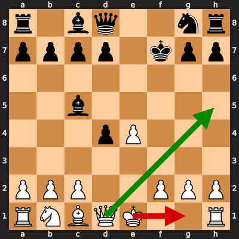

# Analysis: erivera90 vs lillow00

**Date:** 2026.02.10 | **Event:** Live Chess | **Site:** Chess.com

Found **2** crucial moments where evaluation dropped significantly.

## Moment 1

**FEN:** `r1bq2nr/pppp1kpp/8/2b5/3pP3/8/PPP2PPP/RNBQK2R w KQ - 0 8`

- **You Played:** **O-O** ❌ (Red Arrow)
- **Engine Best:** **Qh5+** ✅ (Green Arrow)
- **Eval Swing:** -469 cp
- **Variation:** _Qh5+ g6 Qd5+ Kg7_

### Coach Explanation
Castling weakens the king's position, worsening the evaluation significantly. Qh5+ immediately attacks the king, forcing a response and initiating a strong attack that improves White's position drastically.

---
## Moment 2

**FEN:** `r1bqk2r/ppp1n2p/3p2p1/2bQP3/3p4/8/PPP2PPP/RNB2RK1 w - - 1 12`

- **You Played:** **exd6** ❌ (Red Arrow)
- **Engine Best:** **Qb3** ✅ (Green Arrow)
- **Eval Swing:** -608 cp
- **Variation:** _Qb3 a5 Nd2 a4_

> **⚠️ CRITICAL: Your move allowed the opponent to immediately capture your White Queen on d5.**

### Coach Explanation
BLUNDER: You hung your Queen. The opponent can simply take it with Bxd5. Qb3 develops the Queen to a safer square and attacks b7.

---

## 3 Key Takeaways

The recurring theme in your mistakes seems to be **a hesitation to aggressively develop and capitalize on tactical opportunities**. You missed a crucial attacking sequence involving castling and a direct attack on the king, and you later left your queen undefended.

Here's some actionable advice for your next game:

*   **Be proactive with your pieces:** Don't be afraid to move your pieces to active squares early in the game. Look for opportunities to create threats and put pressure on your opponent.
*   **Calculate forcing moves:** Before making a move, especially when castling, consider checks, captures, and attacks (forcing moves) that your opponent might have. Calculate the consequences.
*   **Queen Safety:** Always double-check that your Queen is adequately defended before and after moving it!

