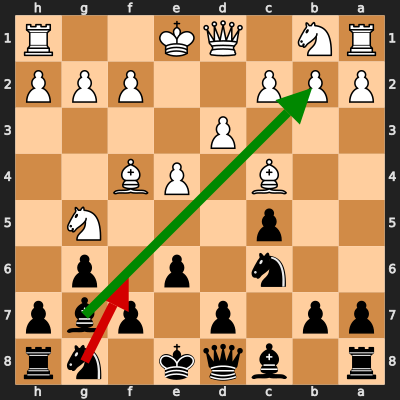
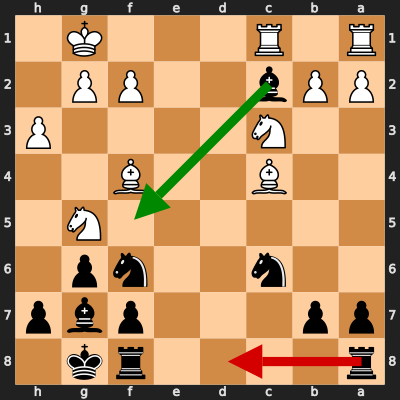
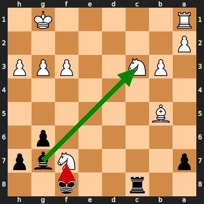
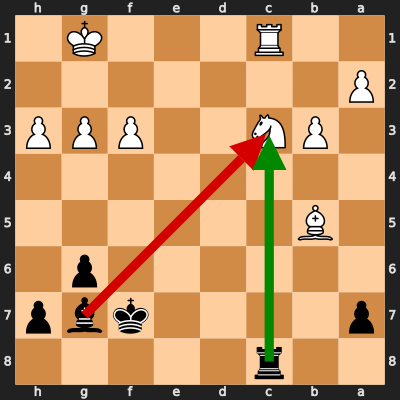
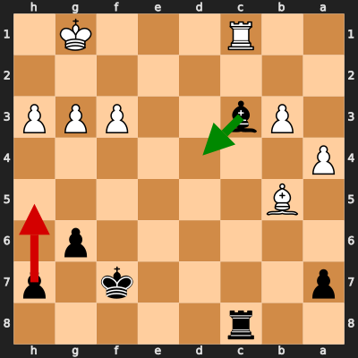
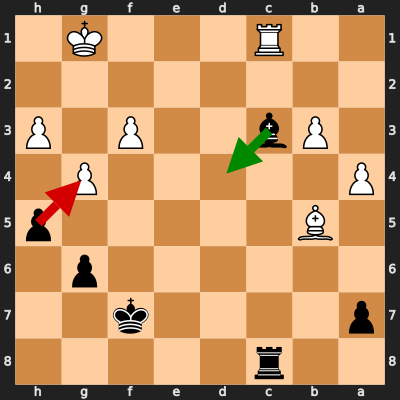
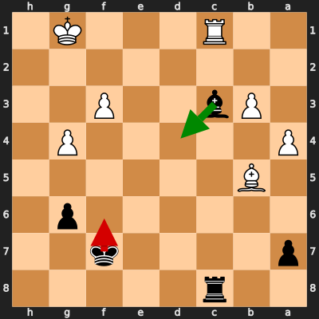

# Analysis: manan_waris18 vs erivera90

**Date:** 2026.02.10 | **Event:** Live Chess | **Site:** Chess.com

Found **7** crucial moments where evaluation dropped significantly.

## Moment 1

**FEN:** `r1bqk1nr/pp1p1pbp/2n1p1p1/2p3N1/2B1PB2/3P4/PPP2PPP/RN1QK2R b KQkq - 2 6`

- **You Played:** **Nf6** ❌ (Red Arrow)
- **Engine Best:** **Bxb2** ✅ (Green Arrow)
- **Eval Swing:** -330 cp
- **Variation:** _Bxb2 c3 Bxa1 O-O_

### Coach Explanation
Development. Nf6 passively develops while ignoring the hanging bishop on c4. Bxb2 immediately attacks, wins material (a pawn), and opens the position for black's pieces while forcing White to react.

---
## Moment 2

**FEN:** `r4rk1/pp3pbp/2n2np1/6N1/2B2B2/2N4P/PPb2PP1/R1R3K1 b - - 1 15`

- **You Played:** **Rad8** ❌ (Red Arrow)
- **Engine Best:** **Bf5** ✅ (Green Arrow)
- **Eval Swing:** -276 cp
- **Variation:** _Bf5 g4 Be6 Nxe6_

> **⚠️ CRITICAL: Your move allowed the opponent to immediately capture your Black Bishop on c2.**

### Coach Explanation
BLUNDER: You hung your Bishop. The opponent can simply take it with Rxc2. Bf5 develops with tempo, attacks the knight on g5, and prepares to exchange for the light squared Bishop to alleviate white's attack.

---
## Moment 3

**FEN:** `2r2k2/p4Nbp/6p1/1B6/8/1PN2PPP/P7/R5K1 b - - 0 25`

- **You Played:** **Kxf7** ❌ (Red Arrow)
- **Engine Best:** **Bxc3** ✅ (Green Arrow)
- **Eval Swing:** -262 cp
- **Variation:** _Bxc3 Nd6 Rd8 Nb7_

### Coach Explanation
King's move Kxf7 walks into a worse position, worsening the evaluation by -262 centipawns. The engine's move, Bishop's capture Bxc3, exploits the pinned knight on c3 and leads to a better position, as the current evaluation suggests.

---
## Moment 4

**FEN:** `2r5/p4kbp/6p1/1B6/8/1PN2PPP/P7/2R3K1 b - - 1 26`

- **You Played:** **Bxc3** ❌ (Red Arrow)
- **Engine Best:** **Rxc3** ✅ (Green Arrow)
- **Eval Swing:** -401 cp
- **Variation:** _Rxc3 Bc4+ Ke8 Rxc3_

### Coach Explanation
Material loss. Bxc3 loses a rook for a bishop, worsening the already losing position. Rxc3 recaptures the attacking piece with a rook, mitigating material loss and allowing for further simplification into a more defendable endgame with a check.

---
## Moment 5

**FEN:** `2r5/p4k1p/6p1/1B6/P7/1Pb2PPP/8/2R3K1 b - - 0 27`

- **You Played:** **h5** ❌ (Red Arrow)
- **Engine Best:** **Bd4+** ✅ (Green Arrow)
- **Eval Swing:** -1065 cp
- **Variation:** _Bd4+ Kf1 Rxc1+ Ke2_

### Coach Explanation
Pawn moves weaken squares. h5 weakens the g5 square and does not create immediate threats, worsening Black's already bad position. Bd4+ immediately attacks the King, forcing it into a passive defense while simultaneously enabling a devastating Rxc1+ that equalizes the game.

---
## Moment 6

**FEN:** `2r5/p4k2/6p1/1B5p/P5P1/1Pb2P1P/8/2R3K1 b - - 0 28`

- **You Played:** **hxg4** ❌ (Red Arrow)
- **Engine Best:** **Bd4+** ✅ (Green Arrow)
- **Eval Swing:** -947 cp
- **Variation:** _Bd4+ Kf1 Rxc1+ Ke2_

### Coach Explanation
Pawn grabbing with hxg4 accelerates the loss due to the exposed king and lack of counterplay. Bd4+ forces the king into a checkmating net, immediately winning material and leading to a favorable endgame.

---
## Moment 7

**FEN:** `2r5/p4k2/6p1/1B6/P5P1/1Pb2P2/8/2R3K1 b - - 0 29`

- **You Played:** **Kf6** ❌ (Red Arrow)
- **Engine Best:** **Bd4+** ✅ (Green Arrow)
- **Eval Swing:** -632 cp
- **Variation:** _Bd4+ Kf1 Rxc1+ Ke2_

### Coach Explanation
King movement Kf6 weakens the pawn structure and fails to capitalize on the exposed white king. Bd4+ forces the king to move, enables a rook sacrifice, Rxc1+, to reach equality by perpetual check.

---

## 3 Key Takeaways

Your game highlighted some areas where proactive piece play and defensive awareness can make a big difference. The recurring theme seems to be a hesitancy to take immediate action and a focus on developing pieces without considering the tactical consequences.

Here's some actionable advice for your next game:

*   **Look for immediate tactical opportunities:** Before making a move, scan the board for hanging pieces, undefended squares, and potential captures. Don't be afraid to grab material when it's available!
*   **Calculate forcing moves (checks, captures, attacks):** Prioritize moves that directly threaten your opponent, especially checks. These often force specific responses and can uncover tactical weaknesses.
*   **Protect your King and evaluate pawn structure:** Pay close attention to the safety of your King and avoid pawn moves that weaken important squares around it. A safe King and a solid pawn structure will give you a better foundation to attack from.

Keep practicing and focusing on these points – you'll see improvement with every game!

