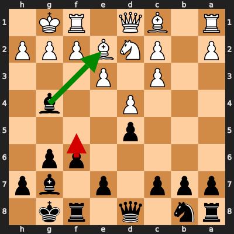
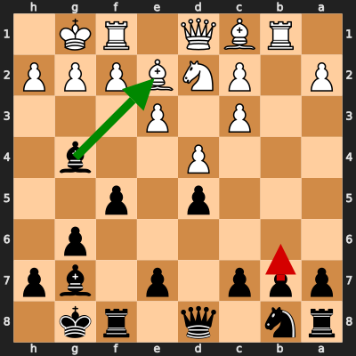

# Analysis: krishM87 vs erivera90

**Date:** 2026.02.12 | **Event:** Live Chess | **Site:** Chess.com

Found **2** crucial moments where evaluation dropped significantly.

## Moment 1

**FEN:** `rn1q1rk1/ppp1p1bp/5pp1/3p4/3P2b1/2P1P3/P1PNBPPP/R1BQ1RK1 b - - 3 10`

- **You Played:** **f5** ❌ (Red Arrow)
- **Engine Best:** **Bxe2** ✅ (Green Arrow)
- **Eval Swing:** -333 cp
- **Variation:** _Bxe2_

### Coach Explanation
Pawn advance f5 weakens the pawn structure and allows White to exploit the newly created weaknesses. Bxe2 immediately eliminates a defender of White's king, creating attacking opportunities and simplifying into a more favorable endgame, which is objectively better. While you ultimately won, f5 was a mistake that put you in a losing position, though it may have posed practical problems for your opponent.

---
## Moment 2

**FEN:** `rn1q1rk1/ppp1p1bp/6p1/3p1p2/3P2b1/2P1P3/P1PNBPPP/1RBQ1RK1 b - - 1 11`

- **You Played:** **b6** ❌ (Red Arrow)
- **Engine Best:** **Bxe2** ✅ (Green Arrow)
- **Eval Swing:** -342 cp
- **Variation:** _Bxe2 Qxe2_

### Coach Explanation
Space. b6 squanders tempi and concedes space to White. Bxe2 immediately eliminates a defender of the White King, forcing Qxe2 and opening the e-file for potential attacks. You were objectively lost here, but this move might have set a practical trap.

---

## 3 Key Takeaways

Your game analysis reveals a tendency to prioritize potentially tricky or space-grabbing moves over more strategically sound, immediate tactical options. You also seem to underestimate the importance of a strong pawn structure.

Here's what you can focus on next time:

*   **Prioritize Tactical Clarity:** Before making a move, ask yourself, "Is there an immediate capture or tactical simplification (like Bxe2) that improves my position?" Look for opportunities to eliminate defenders and open lines.
*   **Evaluate Pawn Structure Carefully:** Analyze the consequences of pawn advances. Ask, "Does this weaken my position in any way?" Strive for solid pawn structures that support your pieces.
*   **Don't Chase Space at All Costs:** Be wary of moves that concede tempi and give your opponent positional advantages. Focus on developing your pieces and controlling key squares effectively, even if it means sacrificing some space. Keep practicing!

